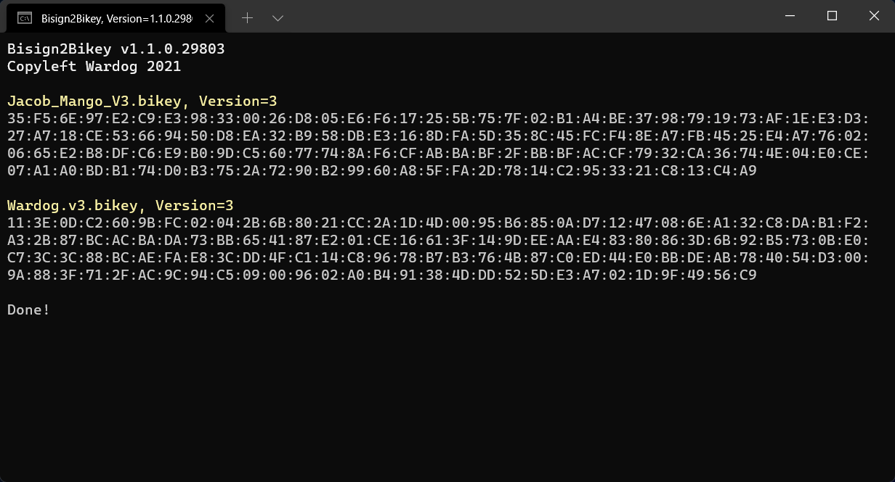

# Bisign2Bikey
Extracts the BI key from BI signature files for DayZ and ArmA titles, currently tested with Bohemia Interactive's version 2 and 3 signatures. 

# Usage
There are various ways to use Bisign2Bikey, any of the following will produce a 'Keys' folder directory that Bisign2Bikey resides in. Can be run unattended without pausing, by adding `/s` as the very last argument.

* Drag any .bisign file(s) over top of the executable
* Drag addons folder(s) of mod over top of the executable
* Drag @ModName folder(s) over top of the executable

# Example
`Bisign2Bikey.exeScripts.pbo.Jacob_Mango_V3.bisign Scripts.pbo.Wardog.v3.bisign  /s`

